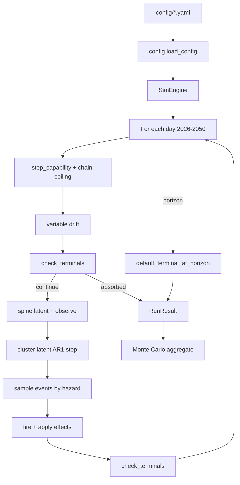

# Architecture

## Design principle

**One joint world per run.** Events are not mutually exclusive story branches. The simulator steps day-by-day; spine milestones and plot events fire stochastically with preconditions, cluster latents modulate correlated hazards, society variables feed back into hazards, variables drift, terminals may absorb.

## Model 2 (current)

| Layer | What it is | Config |
|-------|------------|--------|
| **Latent capability** | Continuous `internal_capability` + calendar RSI | `capability_dynamics.yaml` |
| **Spine** | Threshold crossings + legibility hazard | `spine.yaml` |
| **Plot events** | Policy, alignment, bio, labor beats | `events.yaml` |
| **Society feedback** | State → event hazard multipliers | `society_hazard.yaml` |
| **Terminals** | Absorbing outcomes | `terminals.yaml` |

**Removed from v1:** deterministic `ci_schedule.yaml`, per-milestone `regime_multipliers`, `p_cumulative` on spine milestones.

**Legibility:** latent threshold met → milestone enters `latent_spine`; public `fire` requires daily observability draw (`spine.legibility_daily_hazard`).

## Data flow



## Module responsibilities

| Module | Role |
|--------|------|
| `state.py` | `WorldState` — numeric vars + fired/locked/unlocked + `capability_growth_scale` / `capability_hard_ceiling` |
| `capability.py` | Daily cap growth, calendar RSI, macro couplings |
| `spine.py` | Threshold eligibility, chain ceiling, legibility hazard, fire |
| `society_hazards.py` | Society vars → event hazard multipliers |
| `correlations.py` | Latent cluster shocks; `adjust_hazard()` |
| `events.py` | Eligibility, daily hazard, mutex groups, fire |
| `effects.py` | `on_fire` DSL + `capability_controls` |
| `terminals.py` | Absorbing conditions + horizon defaults (`horizon_only` terminals) |
| `engine.py` | Daily loop + `run_monte_carlo` |
| `cli.py` | JSON summary output |

## Effect DSL (`on_fire`)

```yaml
on_fire:
  unlock: [ev_other]
  lock: [ev_other]
  modify_hazard:
    ev_other: { multiply: 1.5 }
  set_vars:
    bio_governance_tier: { value: 2.5, clamp: [0, 3] }
  add_vars:
    deployment_pressure: { delta: 0.1, clamp: [0, 1] }
  capability_controls:
    growth_scale: 0.78        # multiply ongoing cap growth
    hard_ceiling: 7.2         # absolute cap ceiling
  force_terminal: [doom_extinction_bio]
```

## Pruning

| Mechanism | Config | Purpose |
|-----------|--------|---------|
| Time window | `schedule.start/end` | Event not eligible outside window |
| Once-only | `once: true` | Remove from pool after fire |
| Unlock gate | `requires_unlock` | Chain dependency |
| Mutex | `mutex_group` | Whistleblower variants |
| Daily cap | `max_fires_per_day` | Realism |
| Hazard cap | `max_eligible_checks_per_day` | Performance |

## Performance notes

Precomputed `_window_by_day[day]` lists events whose calendar window contains that day — avoids scanning all events each day.

Target: 10k runs in <40 min pure Python on M4. Future: Numba batch runs, weekly coarse clock option.

## Config files

| File | Role |
|------|------|
| `sim.yaml` | Clock, caps, `use_correlations` |
| `capability_dynamics.yaml` | Model 2 latent growth + calendar RSI |
| `spine.yaml` | 7 probabilistic AI-2027 capability milestones |
| `events.yaml` | 57 plot events, mutex groups |
| `society_hazard.yaml` | Society → event hazard feedback |
| `variables.yaml` | Initial state + daily drift |
| `correlations.yaml` | Cluster membership, ρ, hazard sensitivities |
| `terminals.yaml` | Absorbing outcomes |
