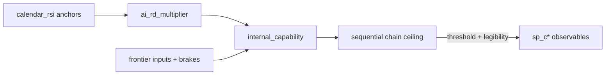

# Capability dynamics (Model 2)

**Config:** [`config/capability_dynamics.yaml`](../config/capability_dynamics.yaml)  
**Code:** `src/futures_sim/capability.py`, `src/futures_sim/spine.py`

## Core idea

Frontier capability is a **continuous latent** `internal_capability` (Ci scale 0–10). It grows each day:

```
Δcap ≈ base_daily_growth × ai_rd_multiplier^α × Π(inputs) × brakes × shock
```

**RSI (AI 2027 style):** `ai_rd_multiplier` follows a **piecewise-linear calendar curve** — not per-milestone regime knobs:

```yaml
calendar_rsi:
  anchors:
    - { date: "2026-01-01", multiplier: 1.13 }
    - { date: "2026-06-01", multiplier: 1.36 }   # Agent-1 / ~C2
    - { date: "2027-06-01", multiplier: 3.5 }    # pre Agent-2
    - { date: "2028-06-01", multiplier: 7.8 }    # Agent-2 / ~C5 bridge
    - { date: "2029-01-01", multiplier: 11.0 }
    - { date: "2030-06-01", multiplier: 50.0 }   # superhuman researcher / ~C9
```

Between anchors: linear interpolation. Same calendar for every run; variance from shocks, `run_heterogeneity`, and state couplings.

**Spine milestones** are **observable** threshold crossings:

1. Latent: `internal_capability` crosses threshold (sequential chain ceiling in `spine.capability_ceiling()`).
2. Public: `observability.daily_hazard` — pause / governance / deception modulate legibility.

## Political coupling (v2.2)

| Mechanism | Effect |
|-----------|--------|
| `observability.daily_hazard` | Cap crossed → public milestone still stochastic |
| `capability_controls` on events | Pause / paralysis / interp halt / screening slow or cap growth |
| `friction_pause_stall` terminal | Pause + cap below C9 |
| `run_heterogeneity` | Per-run growth spread |

## Variables wired into dynamics

| Variable | Role |
|----------|------|
| `internal_capability` | Latent state (driver) |
| `ai_rd_multiplier` | From `calendar_rsi`; feeds cap growth |
| `frontier_capex_index` | Compute/capital |
| `deployment_pressure` | Deploy race |
| `china_frontier_parity` | Geopolitical race |
| `compute_concentration` | RSI-friendly concentration |
| `open_weights_regime` | Knowledge diffusion |
| `frontier_lab_polarization` | Race duplication |
| `gdp_index` | Funding channel + capex pull |
| `governance_capacity` | Race amp + governance brake |
| `public_xrisk_salience` | Regulatory brake |
| `international_coord` | Coordination brake |
| `alignment_trust` | Trust×gov brake; low-trust secret race boost |
| `sovereignty_fragmentation` | Compute fragmentation penalty |
| `admin_ai_posture` | Federal pro-AI capex/growth |
| `kinetic_escalation` | Geopolitical capex/coord penalty |
| `bio_capability_tier` | Dual-use spillover ↔ cap |
| `tech_level`, `employment_stress`, `deception_risk` | Derived couplings |

## Calibration

Tune `base_daily_growth` (currently **0.00136**) + `calendar_rsi` anchors so spine **P(by deadline)** tracks AI-2027 targets — **not** per-milestone `p_cumulative` or `regime_multipliers`.

```bash
python scripts/calibration_check.py -n 2000 --seed 42
python scripts/tune_capability.py -n 500 --seed 42
```

Report includes conditional **P(c5\|c2)**, **P(c9\|c8)**, median fire dates, monotonicity check.

## Mermaid


