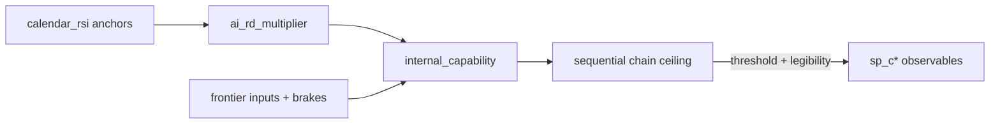

# Capability dynamics (Model 2)

**Config:** [`config/capability_dynamics.yaml`](../config/capability_dynamics.yaml)  
**Code:** `src/futures_sim/capability.py`, `src/futures_sim/spine.py`

## Core idea

Frontier capability is a **continuous latent** `internal_capability` (Ci scale 0–10). It grows each day:

```
Δcap ≈ base_daily_growth × ai_rd_multiplier^α × Π(inputs) × brakes × shock
```

**RSI (AI 2027 style):** `ai_rd_multiplier` follows a **piecewise-linear calendar curve** — not per-milestone regime knobs:

```yaml
calendar_rsi:
  anchors:
    - { date: "2026-01-01", multiplier: 1.13 }
    - { date: "2026-06-01", multiplier: 1.36 }   # Agent-1 / ~C2
    - { date: "2027-06-01", multiplier: 3.5 }    # pre Agent-2
    - { date: "2028-06-01", multiplier: 7.8 }    # Agent-2 / ~C5 bridge
    - { date: "2029-01-01", multiplier: 11.0 }
    - { date: "2030-06-01", multiplier: 50.0 }   # superhuman researcher / ~C9
```

Between anchors: linear interpolation. Same calendar for every run; variance from shocks, `run_heterogeneity`, and state couplings.

**Spine milestones** are **observable** threshold crossings:

1. Latent: `internal_capability` crosses threshold (sequential chain ceiling in `spine.capability_ceiling()`).
2. Public: `observability.daily_hazard` — pause / governance / deception modulate legibility.

## Political coupling (v2.2)

| Mechanism | Effect |
|-----------|--------|
| `observability.daily_hazard` | Cap crossed → public milestone still stochastic |
| `capability_controls` on events | Pause / paralysis / interp halt / screening slow or cap growth |
| `friction_pause_stall` terminal | Pause + cap below C9 |
| `run_heterogeneity` | Per-run growth spread |

## Variables wired into dynamics

| Variable | Role |
|----------|------|
| `internal_capability` | Latent state (driver) |
| `ai_rd_multiplier` | From `calendar_rsi`; feeds cap growth |
| `frontier_capex_index` | Compute/capital |
| `deployment_pressure` | Deploy race |
| `china_frontier_parity` | Geopolitical race |
| `compute_concentration` | RSI-friendly concentration |
| `open_weights_regime` | Knowledge diffusion |
| `frontier_lab_polarization` | Race duplication |
| `gdp_index` | Funding channel + capex pull; **also driven by** capability via `gdp_growth_coupling` (below) |
| `governance_capacity` | Race amp + governance brake |
| `public_xrisk_salience` | Regulatory brake |
| `international_coord` | Coordination brake |
| `alignment_trust` | Trust×gov brake; low-trust secret race boost |
| `sovereignty_fragmentation` | Compute fragmentation penalty |
| `admin_ai_posture` | Federal pro-AI capex/growth |
| `kinetic_escalation` | Geopolitical capex/coord penalty |
| `bio_capability_tier` | Dual-use spillover ↔ cap |
| `tech_level`, `employment_stress`, `deception_risk` | Derived couplings |

## GDP growth coupling (added 2026-07-16, revised 2026-07-16) `[GUESS]` on magnitude

Before this, `gdp_index` had **no connection to capability growth at all** — only 6
discrete event deltas (max combined +0.40 from baseline 1.0), while `ghost_gdp_index`
(a different variable) *did* scale continuously with capability via
`employment_coupling`. This made `gdp_index >= 1.45/1.85/2.5` — the gates on
`utopia_golden_age` and `utopia_radical_abundance` in `config/terminals.yaml` —
mathematically unreachable regardless of how the rest of the run played out.

**First attempt (superseded same day):** an additive daily delta, magnitude picked
empirically to make the existing terminal gdp thresholds land in a "nice-looking"
distribution. This was flagged (correctly) as reverse-engineering a parameter to hit
a target rather than modeling the real mechanism — `gdp_index` is a *level index*
that should compound like real GDP, not accumulate a flat daily amount.

**Current version:** `gdp_growth_coupling` compounds `gdp_index` daily via an
annualized rate = `baseline_annual_growth + tech_level_accel_scale * tech_level`,
converted to a daily compounding factor. Two real-data anchors:

- `baseline_annual_growth: 0.022` (2.2%/yr) — historical long-run real GDP growth,
  US and global both ~2-3%/yr (BEA NIPA long-run series; World Bank WDI). Applied
  from day 1 regardless of capability — economies grow without transformative AI too.
- `tech_level_accel_scale: 0.012` (+1.2pp/yr at `tech_level=1.0`, full deployment) —
  anchored on the closest *real* precedent (general-purpose-technology diffusion:
  Jorgenson/Stiroh-style growth accounting attributes roughly +0.5-1.0pp of annual US
  TFP growth to IT during its ~1995-2004 peak diffusion), not AI-specific speculation.
  Deliberately far below the "AI explosive growth" literature's central-to-high
  estimates (Davidson 2021, Open Philanthropy: 20-30%+/yr in full-automation
  scenarios; tempered by Erdil & Besiroglu 2023's bottleneck critique) — because (a)
  `tech_level` saturates near 1.0 and *never decays* for most horizon-surviving runs,
  so even a modest rate compounds over 15-20+ sustained years, and (b) this sim
  already has separate frictions (`deployment_pressure`, `governance_capacity`,
  `sovereignty_fragmentation`, `compute_concentration`) damping how much latent
  capability reaches real deployment — stacking the literature's most aggressive
  rate on top would double-count those frictions. Full rationale in
  `config/capability_dynamics.yaml`'s inline comment.

**Resulting distribution** (n=500, seed=42): `gdp_index` p50≈2.2, p90≈2.4, p99≈2.6 —
most horizon-surviving runs clear `utopia_modest_welfare`/`utopia_golden_age`'s gdp
gates (this is expected and *not* a problem: `governance_capacity`, `inequality_index`,
`distribution_regime`, and the required events remain the binding constraints for
those terminals — matching the research finding that GDP growth itself is the modal
case and *distribution* is the rare, hard part). **Resolved 2026-07-16**: raised the
`utopia_radical_abundance` gate to gdp_index≥2.5 (matching the canonical
`terminals.` definition, which had drifted from `horizon_default`'s 1.85) — now a
genuinely rare ~2.2% rather than 12.6%. See `docs/CALIBRATION.md` "Terminal
reachability" for the before/after.

## Sustained drag: kinetic escalation, governance collapse, sovereignty fragmentation

Added 2026-07-16 alongside a `capability_drop` mechanism (below) after the owner
pointed out that `kinetic_escalation`, governance collapse, and
`sovereignty_fragmentation` only ever slowed AI *capability* growth
(`_growth_factor`'s existing brake terms) and never touched `gdp_index` at all —
meaning an active war (`ev_taiwan_kinetic`) cost GDP exactly one event-delta, then
growth resumed unaffected the very next day, regardless of the war still being
ongoing (`kinetic_escalation` has no decay mechanism — once elevated, it stays
elevated for the rest of the run).

`gdp_growth_coupling` now subtracts three ongoing drag terms from the annual rate
for as long as the underlying state is bad (not just once):

- `kinetic_drag_scale: 0.10` — -10pp/yr at `kinetic_escalation=1.0` (active
  great-power war). Grounded in IMF WEO's ~-0.5 to -1pp global spillover estimate
  from the (regionally contained) Russia-Ukraine war, scaled up toward Bloomberg
  Economics' (2024) ~$10T / ~10%-of-global-GDP estimate for a full US-China Taiwan
  conflict given the chip-supply chokepoint. At `kinetic_escalation=0.45` (one
  `ev_taiwan_kinetic` firing, not full WMD escalation) this costs ~4.5pp/yr —
  enough to push net growth to roughly flat/mildly negative, not untouched.
- `governance_collapse_drag_scale: 0.02` — -2pp/yr at `governance_capacity=0` vs a
  0.5 reference. Smaller and slower than the kinetic term on purpose — real
  institutional-quality/growth literature (Kaufmann-Kraay-Mastruzzi
  governance-indicator regressions; Acemoglu & Robinson) finds real but modest
  effects at this scale.
- `fragmentation_drag_scale: 0.012` — -1.2pp/yr at `sovereignty_fragmentation=1.0`.
  IMF SDN "Geoeconomic Fragmentation and the Future of Multilateralism" (2023)
  estimates global GDP *level* losses of ~0.2%-7% across limited-to-severe
  decoupling scenarios; approximated here as an annual-rate drag.

**Empirical check** (n=800, seed=42): the 6 runs where `ev_taiwan_kinetic` fired
show final `gdp_index` p50=**0.465** vs **1.349** for the other 794 runs — a real,
lasting economic scar, not a one-day dip that recovers.

## Capability regression: `capability_drop`

Before this, `internal_capability` could only ever *slow down* (via
`capability_growth_scale`/`hard_ceiling` controls), never actually decline — no
mechanism represented physical destruction of compute infrastructure, verified
capability rollback, brain-drain, or an energy crisis forcing capacity offline.
`effects.py::apply_effects` now supports `capability_controls.capability_drop` — an
absolute one-time reduction to `internal_capability` (not `ci_level`, the
public/observed-milestone tracker, which is a running max and correctly does *not*
reverse — already-trained models and know-how don't get un-invented because some
fabs were destroyed; only the ability to keep advancing is set back).

Wired into `ev_taiwan_kinetic` (`capability_drop: 0.5`, of ~10-11 max Ci scale) —
grounded in the real chokepoint (Taiwan/TSMC fabricates the large majority of
leading-edge logic chips; Chris Miller, *Chip War*, 2022) but the magnitude itself
is `[GUESS]` — there is no clean real-world conversion from "fabs destroyed" to
"Ci units lost."

**Empirical finding, not (yet) further tuned**: at n=800, all 6 runs where
`ev_taiwan_kinetic` fired end with `internal_capability` back at the 11.0 ceiling —
the drop gets regrown within weeks to months, because by the time this event is
eligible (2028-2035) most runs are already past `sp_c8`/`sp_c9` where the calendar
RSI multiplier reaches ~50x, and `ev_taiwan_kinetic` itself boosts
`ev_race_acceleration`'s hazard 1.5x. Read charitably, this is a coherent (if
unintended) emergent story rather than a bug: a Taiwan war devastates the civilian
economy durably but doesn't necessarily halt the capability race itself — an
analogue to wartime R&D acceleration (Manhattan Project, radar, jet engines all
*accelerated* during WWII even as civilian economies were damaged). Left as-is;
would add a matching sustained capability-growth penalty (mirroring the GDP drag
terms above) if the owner wants "war actually stops the race" modeled instead.

## Autonomy erosion: `human_autonomy_index`

Found while preparing a headline number for publication: `human_autonomy_index`
had the same missing-continuous-mechanism bug as `gdp_index`/`inequality_index`/
`employment_stress` originally did — only discrete event deltas, never observed
below ~0.53 across 800 runs. This silently made 3 of `doom_whimper`'s 4
`horizon_default` paths (needing autonomy ≤0.32/0.40/0.48) unreachable, collapsing
that terminal from the published blog's ~15% down to ~1.5-1.8% with nothing
flagging it — "never observed that low" doesn't trip a mathematical-impossibility
check the way `gdp_index < 1.45` did, so it took a manual before/after comparison
against previously-published numbers to catch.

`autonomy_erosion` (`config/capability_dynamics.yaml`) adds continuous erosion
scaled by `tech_level * deployment_pressure * (1 - alignment_trust)`, offset by
continuous protection scaled by `tech_level * governance_capacity`. This is the
mechanism Christiano's *What Failure Looks Like* (2018) describes — gradual loss
of human oversight as deployment outpaces trustworthy alignment — which the blog
post already cites as the reference case for its friction/whimper modal path, but
which the model had no actual mechanism for until now. `[GUESS]` on magnitude
(0.0003 for both erosion and protection scale, symmetric so a "modal" run roughly
holds autonomy steady, a "bad" run — high deployment pressure, low trust, weak
governance, full deployment — can erode it by 1.0+ over 15 years, a "good" run
drifts it upward).

**Result** (n=800, seed=42): `doom_whimper` 1.5-1.8% → **4.9%**;
`friction_surveillance` (same autonomy band) 0.1% → **1.2%**. Region mix: doom
7.1%, severe 5.9%, friction 67.8%, utopia 19.2%.

## Calibration

Tune `base_daily_growth` (currently **0.00136**) + `calendar_rsi` anchors so spine **P(by deadline)** tracks AI-2027 targets — **not** per-milestone `p_cumulative` or `regime_multipliers`.

```bash
python scripts/calibration_check.py -n 2000 --seed 42
python scripts/tune_capability.py -n 500 --seed 42
```

Report includes conditional **P(c5\|c2)**, **P(c9\|c8)**, median fire dates, monotonicity check.

## Mermaid


