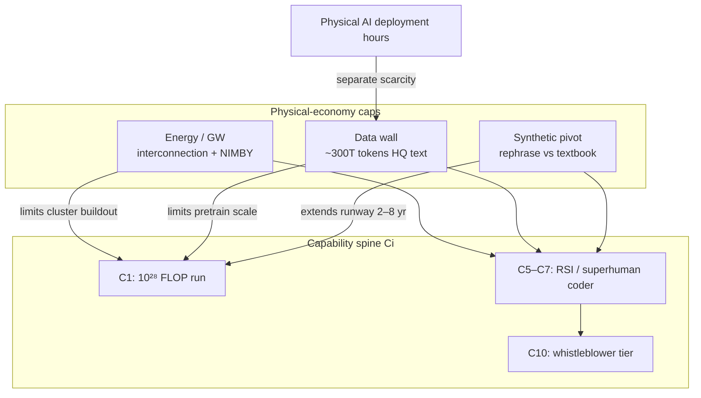

> **Ported from:** `notes/timeline_prediction/crosscut_physical_economy_limits.md` · snapshot from private monorepo · canonical edit in private monorepo until OSS lock

# Cross-Cut — Physical Economy Limits on Ci (X2-B)

> **Parent:** [`../reference/03_ci_spine.md`](../reference/03_ci_spine.md)  
> **Embodied companion:** [`node_physical_ai_evidence_rationale.md`](node_physical_ai_evidence_rationale.md)  
> **Cosmic-scale limits (Tier 1–2):** [`../superintelligence_physical_limits.md`](../superintelligence_physical_limits.md)  
> **Evidence rationale:** [`node_physical_ai_evidence_rationale.md`](./node_physical_ai_evidence_rationale.md) §energy §data  
> **Date:** 2026-07-04

---

## Thesis (one paragraph)

The capability spine **C0–C10** is usually modeled as software + compute scaling. Three **Earth-economy** constraints bind **before** cosmic physics matters: **(1) electricity / GW delivery** for GPU clusters, **(2) high-quality training text exhaustion**, **(3) synthetic-data pivot quality**. They interact: power caps **FLOP/s**; data caps **sample efficiency**; synthetic data trades **diversity for throughput**. Together they form a **hard-cap crux** on how fast Ci advances — potentially **0.5–0.85×** the AI 2027 / METR fast track if binding **before 2028**.

---

## Three constraints (interconnected)

| Constraint | Binds Ci at | Modal effect on fast track | Tail (constraint bites hard) |
|------------|-------------|---------------------------|------------------------------|
| **Energy** | **C1–C7** (now–2028) | **+10–20%** delay on largest runs; regional not global stall | **0.5–0.7×** pace 2027–2030; idle H100s; labs shift to inference/synthetic |
| **Data wall** | **C1–C6** | Absorbed by filtering + multi-epoch (Epoch revision) | Pretrain scaling **plateaus** 2027–2029; quality regression |
| **Synthetic pivot** | **C2–C8** | **~30%** rephrased mix extends runway; 5–10× loss speedup at large budget | Model collapse on textbook-style; web polluted by AI slop |
| **Embodied data** | **C5+** manipulation | Parallel track — see embodied node | Robot-hour scarcity caps VLA not LLM reasoning |

---

## 1. Energy / electricity (GW hard cap)

### Scale (2026)

| Metric | Value | Source tier |
|--------|-------|-------------|
| US datacenter load | **~42 GW** (2026), from **~23 GW** (2023) | Industry est. |
| GPU-only incremental need | **~12 GW** (2026), **~20 GW** (2027) | Creative Strategies 2026 |
| Grid interconnection queue | **~2.3 TW** queued; **6–8 yr** waits | PJM, industry |
| Deliverable new grid capacity by 2028 | **~25 GW** vs **~44 GW** AI demand delta | FT / Scroggie synthesis |
| **Shortfall** | **~19 GW (~43%)** without on-site gen | Speculative aggregate |
| NIMBY / pipeline | Primary-market construction **↓** H2 2025 (5,994 MW vs 6,350 MW); vacancy **1.4%** | CBRE H2 2025 |
| Rack density | **30–130 kW/rack** (AI) vs **5–15 kW** legacy | Rubin roadmap |

### Modal (~60%)

- Hyperscalers **build through** constraint via **on-site gas/nuclear PPAs**, **behind-the-meter**, secondary markets (Ohio, Texas, Nordics).
- **Largest single runs delayed 6–18 mo** but **no global training halt**.
- Microsoft-class **idle compute** episodic, not permanent.
- Ci fast track slows to **~0.85×** not **0.5×**.

### Tail (~25%) — Energy as **the** capability hard cap

- **≥5** frontier-scale sites each **>1 GW** cannot energize by **2028** despite signed contracts.
- **Interconnection reform fails**; transformer lead times **>3 yr** unchanged.
- Labs **publicly** guide down training run frequency; Epoch **10²⁸** runs slip **2028 → 2030+**.
- **0.5–0.7×** effective Ci pace 2027–2030.
- **Geopolitical split:** US/EU constrained; Middle East + China **less** constrained → Node 3 acceleration.

### Link to `superintelligence_physical_limits.md`

Earth-scale training is **Landauer-limited** long before Bekenstein:

- **~10²⁶ W** stellar output is Tier 1 cosmic; **~10¹¹–10¹² W** global human electricity today.
- A **1 GW** datacenter ≈ **3×10⁹ W** — **0.3%** of US grid peak — one site = one nuclear reactor (FT framing).
- **Cannot** "infinite scale on Earth" — cosmic doc §2.1 Tier 0→1 transition **requires** energy acquisition beyond grid; datacenter NIMBY is the **first** binding surface for capability, decades before Dyson.

**Crux statement:** *If deliverable US grid + on-site gen < 30 GW incremental for AI by 2028, P(C7 by 2029) drops ≥10pp.*

---

## 2. Data wall + synthetic pivot

### Data exhaustion (Epoch AI, revised 2024–25)

| Stock | Estimate | Exhaustion (80% CI) |
|-------|----------|---------------------|
| High-quality public text | **~300T tokens** (90% CI 100T–1T) | **2026 – 2032** |
| Compute-optimal single run | Up to **~5×10²⁸ FLOP** (~2028) | Limited by data not compute |
| **Overtraining** (5× Chinchilla-optimal) | Collapses timeline to **~2027** | Llama-style inference-efficient models |
| Low-quality language | 2030–2050 | Secondary |

**Modal:** Labs **already** on multi-epoch + aggressive filtering (Common Crawl quality models) → **2028–2030** effective exhaustion for **next OOM** pretrain, not 2026 cliff.

### Synthetic data pivot

| Strategy | Evidence | Ci implication |
|----------|----------|----------------|
| **Rephrased synthetic + 2/3 natural** | EMNLP 2025: **5–10×** loss speedup at large budget; **~30%** synthetic optimal | **Extends** C1–C5 runway **2–5 yr** |
| **Textbook-style pure synthetic** | Model collapse patterns even in mix | **Hurts** reasoning breadth |
| **Recursive gen-on-gen** | Theoretical collapse unless fresh real data injected | Tail risk for open-web training |
| **Verification / MGT detection** | EMNLP 2025 resampling prevents collapse | Becomes **mandatory** pipeline cost |
| **Altman position** | "High-quality synthetic yes; low-quality no" | Industry default = **curated** synthetic |

**Interaction with energy:** Synthetic generation **burns inference FLOPs** → trades **data scarcity** for **power scarcity** — net Ci effect **ambiguous** unless gen is cheaper than human data acquisition (likely true at scale).

**Interaction with physical AI:** Manipulation/video data **not** replaced by text synthetic — EgoScale flywheel needs **real robot hours** ([`node_physical_ai_evidence_rationale.md`](node_physical_ai_evidence_rationale.md)).

---

## 3. Combined scenarios (Ci timing)

| Scenario | P | C5 (~continuous learning) | C7 (~internal genius country) | C10 |
|----------|---|---------------------------|-------------------------------|-----|
| **S0: No bind** (software-only cruxes) | **0.25** | 2027 H1 (AI 2027 calendar) | 2027 H1 | 2028 Q1–Q2 @ 0.70× tracker |
| **S1: Modal physical economy** | **0.55** | **2027 H2 – 2028** | **2028 – 2029** | **2029 – 2030** |
| **S2: Energy-hard-cap tail** | **0.15** | **2029+** | **2030+** | **2031+** or undefined |
| **S3: Data-collapse tail** (bad synthetic) | **0.05** | Plateau / capability regression | Delayed | — |

**Hybrid time rule update (conditional):** If S1 or S2 materializes, **slow track stays +30%** for politics but **fast track becomes 0.75–0.85×** (not just tracker 0.70× on drama — **physical** drag on top).

---

## p(doom) + society impact

| Bucket | Energy-hard-cap | Data-wall + bad synthetic | Modal |
|--------|-----------------|---------------------------|-------|
| **Extinction** | **↓ modest** (slower RSI → more time for alignment?) **OR ↑** (race + corner-cutting) — **net ±2pp** | **↓** if plateau real | Unchanged baseline |
| **Whimper** | **↑** if China/Middle East unconstrained wins deploy race | **↓** if global plateau | — |
| **Severe recoverable** | Grid strain → brownouts, water fights (NIMBY) | Model quality regressions → institutional trust collapse | Localized |
| **Concentrated harm** | Electricity price ↑ near DCs; environmental justice | AI slop floods media/jobs | **↑** ongoing |

**Non-doom:** Energy constraint → **more distributed inference**, **smaller models**, **regional champions** — not necessarily safer, but **slower** takeoff narrative. Data wall → **vertical FMs** (finance, law, bio) with proprietary data moats widen lead over open weights.

---

## Load-bearing cruxes (for `my_pdoom.md`)

| # | Crux | If true → | If false → |
|---|------|-----------|------------|
| **PE1** | Deliverable AI power **<70%** of announced GW by 2028 | Ci **0.6–0.8×**; Node 3 race asymmetry | Ci on METR track |
| **PE2** | HQ text exhausted **before** 5×10²⁸ FLOP run | C1–C5 spacing widens; synthetic quality decisive | AI 2027 C1–C5 calendar holds |
| **PE3** | Rephrased synthetic **≥30%** mix works at frontier scale | Data wall **pushback 3–5 yr** | Collapse / plateau 2027–28 |
| **PE4** | NIMBY + interconnection ** worsen** 2026–28 | US/EU lag; Gulf/China gain | Constraint absorbed by capex |

---

## Falsifiers

- **Three** confirmed **10²⁸+** public runs **on schedule** 2027–28 with no power-cited delays → PE1 **weakened**
- Epoch revises HQ exhaustion **past 2035** with new stock estimate → PE2 **weakened**
- Frontier model trained **>50%** synthetic with **no** benchmark regression → PE3 ** strengthened**
- CBRE pipeline **re-expands** >7 GW under construction 2027 → NIMBY tail **weakened**

---

## Sources

- [`../superintelligence_physical_limits.md`](../superintelligence_physical_limits.md) — Landauer, Tier 0–1, Earth vs cosmic
- Epoch AI: [Will we run out of data?](https://epoch.ai/publications/will-we-run-out-of-data-limits-of-llm-scaling-based-on-human-generated-data)
- arXiv:2510.01631 — synthetic scaling laws (EMNLP 2025)
- arXiv:2404.05090 — model collapse statistical analysis
- Creative Strategies: [AI Infrastructure Buildout 2026](https://creativestrategies.com/research/the-ai-infrastructure-buildout-a-comprehensive-framework-for-the-datacenter-and-power-cycle/)
- [The Register / CBRE](https://www.theregister.com/on-prem/2026/03/04/nimby-pushback-begins-to-bite-us-datacenter-buildout/5036252) — NIMBY pipeline shrink
- `<!-- private monorepo only -->` — Epoch compute projections
- `crosscut_physical_economy_limits.md` — hybrid time rule baseline
