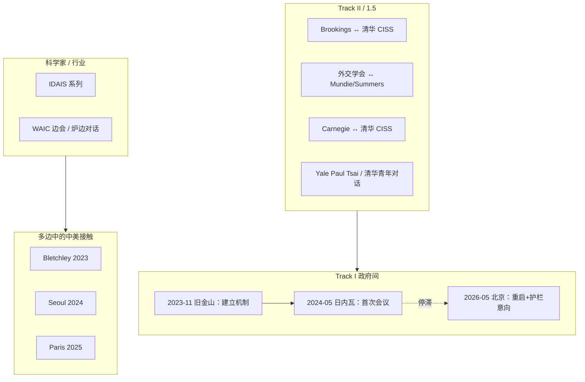

> **Ported from:** `notes/research_us_china_ai_dialogues.md` · snapshot from private monorepo · canonical edit in private monorepo until OSS lock

# 中美 AI 对话与会议：全景盘点（截至 2026-06-01）

**用途：** 可核查的中美人工智能相关沟通渠道清单——政府间（一轨）、专家/智库（二轨）、科学家倡议、多边峰会中的双边接触、以及元首/国安层级承诺。  
**姊妹文档（国际多边平台）：** [`research_international_ai_governance_platforms.md`](./research_international_ai_governance_platforms.md) — UN、WEF、APEC、G7/OECD、峰会系列、REAIM 等「大家在谈什么」。  
**方法：** 2026-06-01 网络检索 + 官方新闻稿/机构公告交叉核对。  
**注意：** “会议/对话”按**有记录的会晤或机制性会谈**计数；不含纯媒体评论或未证实的闭门会。

---

## 执行摘要（直接回答「有多少」）

| 类别 | 数量（有公开记录） | 状态（2026-06-01） |
|------|-------------------|-------------------|
| **政府间（Track I）专项 AI 对话** | **1 次已举行**（2024-05-14 日内瓦）+ **1 次机制重启承诺**（2026-05 北京峰会） | 2024-08 同意「适时」第二轮，**未见公开举行的第二轮**；2024-05 后至 2026-05 前**无正式政府间 AI 会谈** |
| **元首/国安层 AI 相关政治承诺** | **≥4 个节点**（2023-11 旧金山建机制；2024-11 利马核决策人类控制；2026-05 北京重启对话+护栏协议意向） | 具约束力的条约级成果**极少**；多为原则或意向 |
| **持续二轨机制（系列）** | **≥4 条长期线**（清华 CISS–Brookings；外交学会–蒙迪/萨默斯；清华 CISS–Carnegie；Yale Paul Tsai 等） | **仍在进行**（2025 年多场） |
| **科学家倡议（IDAIS 等）** | **4 届 IDAIS**（2023 牛津 → 2024 北京/威尼斯 → 2025 上海）含大量中美学者 | 非政府谈判，产出共识声明 |
| **多边峰会中中美同台谈 AI** | **≥4 场**（布莱切利 2023、首尔 2024、巴黎 2025、WAIC 等） | 非双边专场；立场常分裂（巴黎：中签署、美未签部长级声明） |

**一句话：** 中美**专门**的政府间 AI 对话，公开记录上只有 **2024 年日内瓦 1 次**；2026 年 5 月特朗普–习近平北京峰会同意**重启**政府间对话并谈「护栏」最佳实践，**具体场次尚未举行**。与此同时，**二轨与科学家对话远多于政府间**，且自 2023 年起未中断。

---

## 一、分类框架

---

## 二、政府间（Track I）与元首层承诺

### 2.1 机制时间线

| 日期 | 事件 | 类型 | 主要来源 |
|------|------|------|----------|
| **2023-11-15** | 拜登–习近平旧金山（Woodside / 斐洛里庄园）：同意**建立中美人工智能政府间对话机制** | 元首共识 | [中国外交部](https://www.fmprc.gov.cn/wjbzhd/202401/t20240127_11234565.shtml)、[China US Focus](https://www.chinausfocus.com/peace-security/china-and-the-united-states-begin-official-ai-dialogue) |
| **2024-01-26/27** | 王毅–沙利文**曼谷**：落实旧金山共识；同意**2024 年春**举行 AI 政府间对话**首次会议** | 国安战略沟通 | [外交部](https://www.fmprc.gov.cn/wjbzhd/202401/t20240127_11234565.shtml) |
| **2024-04-27** | 王毅–布林肯北京：五点共识含举行 AI 政府间对话首次会议 | 外长会谈 | 见 [微信综述](https://mp.weixin.qq.com/s/UB3ykn63hevCPdjPIXar5Q) 引述路透等 |
| **2024-05-14** | **中美人工智能政府间对话首次会议**，瑞士**日内瓦** | **迄今唯一一次专项政府间 AI 全会** | [央视](https://news.cctv.com/2024/05/15/ARTIIvG55tknLsj93CHilQdX240515.shtml)、[出口管制信息网](https://exportcontrol.mofcom.gov.cn/article/zjsj/202405/1001.html) |
| **2024-08-27/28** | 王毅–沙利文**北京**：同意**适时举行第二轮**中美人工智能政府间对话 | 国安战略沟通 | [外交部](https://www.mfa.gov.cn/web/wjbz_673089/xghd_673097/202408/t20240828_11480627.shtml)、[DW 综述](https://www.dw.com/zh/%E7%BE%8E%E5%9B%BD%E5%9B%BD%E5%AE%B6%E5%AE%89%E5%85%A8%E9%A1%BE%E9%97%AE%E6%B2%99%E5%88%A9%E6%96%87%E5%9C%A8%E4%B8%AD%E5%9B%BD%E8%B0%88%E4%BA%86%E4%BA%9B%E4%BB%80%E4%B9%88/a-70073004) |
| **2024-11-16** | 拜登–习近平**利马**：**人类**须保持对**使用核武器**决策的控制（非 AI 专场，但与 AI–核交叉高度相关） | 元首原则声明 | [NPR](https://www.npr.org/2024/11/16/nx-s1-5193893/xi-trump-biden-ai-export-controls-tariffs)、[CNBC](https://www.cnbc.com/2024/11/17/biden-xi-agree-that-humans-not-ai-should-control-nuclear-arms.html) |
| **2026-05-13–15** | 特朗普–习近平**北京**峰会：元首就 AI **建设性交流**；同意开展**人工智能政府间对话**；美方称将谈**护栏**、防止前沿模型落入**非国家行为体** | 元首 + 意向协议 | [MOFA 证实](https://www.voachinese.com/amp/why-washington-and-beijing-are-talking-ai-now-20260521/8152453.html)、[AISafety China 简报](https://aisafetychina.substack.com/p/china-us-launch-ai-dialogue-chinese)、[Reuters 引述 Bessent](https://www.gulf-insider.com/us-china-launch-ai-safety-talks-after-trump/) |

### 2.2 2024-05-14 日内瓦首次会议（细节）

- **共同主持：** 中方杨涛（外交部美大司）；美方 Seth Center（国务院关键与新兴技术代理特使）、Tarun Chhabra（白宫国安会技术与国家安全高级主任）。
- **中方参会：** 科技部、发改委、网信办、工信部、中央外办等。
- **美方参会：** 白宫国安会、国务院、商务部等。
- **议题：** AI 科技风险、全球治理、各自关切；中方强调 UN 主渠道、反对美方对华 AI 限制。
- **成果：** **无联合声明、无具体决定**；双方表示满意于交换意见。美方带技术向 AI 安全研究人员；中方代表团被部分观察家描述为更偏外交与**芯片管制**议程——[Awesome Agents 2026 回顾](https://awesomeagents.ai/news/us-china-ai-safety-talks-summit/) 引 Reuters 叙事。

### 2.3 2026-05 北京峰会（重启，尚未落地）

- **中方：** 外交部 2026-05-19 证实元首同意**开展人工智能政府间对话**（[VOA 中文](https://www.voachinese.com/amp/why-washington-and-beijing-are-talking-ai-now-20260521/8152453.html)）。
- **美方：** 财政部长 **Scott Bessent** 称将与中方建立关于 AI **最佳实践**的 **protocol**，重点为**非国家行为体**无法获得最强模型；称美方因 AI **领先**才愿谈（CNBC 边会采访，见 [Gulf Insider](https://www.gulf-insider.com/us-china-launch-ai-safety-talks-after-trump/)）。
- **时间表：** Bessent 曾称 **4–8 周内**可能启动会谈（[AISafety China](https://aisafetychina.substack.com/p/china-us-launch-ai-dialogue-chinese)）；**中方未官方确认**该窗口。
- **未发布：** 无单独、详细的联合 AI 文本；北京读报 heavily 强调台湾；美方读报侧重贸易与采购。

---

## 三、二轨 / 一轨半（Track II & 1.5）——数量远多于政府间

Sandia 2025 报告引述「State of AI Safety in China」：**2022 年以来至少 8 场**美中 Track 1.5/2 AI 主题对话，其中 **2 场**聚焦前沿 AI 安全与治理（见 [Sandia PDF](https://www.sandia.gov/app/uploads/sites/148/2025/04/Challenges-and-Opportunities-for-US-China-Collaboration-on-Artificial-Intelligence-Governance.pdf)）。

### 3.1 长期机制（系列）

| 机制 | 牵头方 | 起始 | 截至 2026 初的公开场次 | 备注 |
|------|--------|------|------------------------|------|
| **中美人工智能与国际安全二轨对话** | 清华 **CISS** ↔ **Brookings** | 2019-10 | **≥12 轮**（2025-02 慕尼黑为第 XII 轮） | 术语手册、军事场景推演；[Brookings](https://www.brookings.edu/articles/laying-the-groundwork-for-us-china-ai-dialogue/)、[CISS 活动页](https://ciss.tsinghua.edu.cn/info/event/8009) |
| **中美人工智能二轨对话**（外交学会线） | 中方 **王超**（中国人民外交学会）；美方 **Craig Mundie** + **Larry Summers** | ~2023 后系统化 | **≥5 次**（2025-02-28 第三；2025-05-13 第四；2025-07-01 第五） | 全球 AI 信任框架等；[腾讯新闻](https://news.qq.com/rain/a/20250318A08QRK00)、[智源](https://hub.baai.ac.cn/view/47263) |
| **2025 China-U.S. Track II Dialogue** | 清华 CISS ↔ **Carnegie** | 2025-04-03 | 1 场（虚拟） | DeepSeek、发展中国家技术扩散；[CISS](https://ciss.tsinghua.edu.cn/info/Conferences/8185) |
| **Paul Tsai China Center AI 治理对话** | **Yale Law** ↔ 中方智库/欧方 | 2019 起多轮 | 2023 秋 Yale（LLM）；**2024-05 Oxford**（基础模型）等 | [Yale Law 新闻](https://law.yale.edu/yls-today/news/center-advances-us-china-understanding-ai-governance) |
| **Tsinghua–Yale 青年对话** | CISS ↔ Paul Tsai Center | 多届 | **2025-04-19** 第三届全会（线上） | AI 标准、可解释性等；[CISS](https://ciss.tsinghua.edu.cn/info/Conferences/8261) |
| **Yale–人大 学生 AI 对话** | Jackson Schmidt Program ↔ 人大 | 2023 起 | **第三届** 2025 春 | 非政府谈判但培养管道；[Yale Jackson](https://jackson.yale.edu/news/schmidt-program-hosts-third-annual-ai-dialogue-with-chinese-scholars-and-students/) |

### 3.2 单次/并行 notable 二轨

| 日期 | 地点 | 内容 | 来源 |
|------|------|------|------|
| **2024-05**（日内瓦政府间同周） | **泰国** | 美中专家 Track 2：AI 标准、化武/生武与生成式 AI 等（闭门） | [DefenseScoop](https://defensescoop.com/2024/05/20/us-china-track-2-dialogue-ai-experts-meeting-thailand/) |
| **2025-07-27** | 上海 **WAIC** | 崔天凯 × Mundie 炉边对话；二轨与 WAIC 治理论坛联动 | [智源实录](https://hub.baai.ac.cn/view/47863) |

### 3.3 Brookings–CISS 线要点（为何重要）

- 2019 起跨越 **拜登与特朗普** 两届美国政府；Fu Ying、Cecilia Rouse 等参与第 XII 轮（2025-02-13/14，慕尼黑）。
- 产出：**AI 术语联合工作组**（中方 64 条、美方 42 条、共同解释 25 条）；军事 AI **想定推演**与信任措施研究（[CISS 阶段性报告](https://ciss.tsinghua.edu.cn/info/wzjx/7040)）。
- 明确目标之一：为**政府间对话**铺路——2023-11 旧金山承诺后官方渠道开启。

---

## 四、科学家倡议：IDAIS（强中美参与，非两国政府谈判）

| 届次 | 时间 | 地点 | 与中美关系 |
|------|------|------|------------|
| **IDAIS-Oxford** | 2023-10 | 英国 Ditcheley | 姚期智、Bengio、Russell 等；美中欧加科学家 |
| **IDAIS-Beijing** | 2024-03-10/11 | 北京（BAAI 合作） | 图灵奖得主 + 中方官员/CEO 会见；**红线**共识 |
| **IDAIS-Venice** | 2024 | 威尼斯 | 安全作为「全球公共品」 |
| **IDAIS-Shanghai** | 2025-07-22–25 | 上海（期智研究院等） | **上海共识**：欺骗风险、可验证红线、Safe-by-Design |

完整列表：[idais.ai/dialogues](https://idais.ai/dialogues/)

---

## 五、多边峰会中的中美 AI 接触（非双边专场，但计入「讨论」）

| 峰会 | 时间 | 中美参与要点 |
|------|------|----------------|
| **[Bletchley AI Safety Summit](https://www.gov.uk/government/publications/ai-safety-summit-2023-the-bletchley-declaration/the-bletchley-declaration-by-countries-attending-the-ai-safety-summit-1-2-november-2023)** | 2023-11-01/02 | **两国均签署**《布莱切利宣言》；中国科技部副部长吴朝晖率团 |
| **[AI Seoul Summit](https://www.gov.uk/government/news/new-commitmentto-deepen-work-on-severe-ai-risks-concludes-ai-seoul-summit)** | 2024-05-21/22 | 中国**到场**讨论；**未签**首尔部长声明（27 国+欧盟签署）；**智谱 AI** 签 Frontier AI Safety Commitments |
| **[AI Action Summit, Paris](https://en.wikipedia.org/wiki/AI_Action_Summit_2025)** | 2025-02-10/11 | 中国副总理**张国清**讲话并签「包容可持续 AI」声明；**美国未签**该声明；JD Vance 演讲反过度监管、暗指勿与「威权政权」合作 |
| **WAIC 2025** | 2025-07 | IDAIS-Shanghai + 中美学者/前外交官公开论坛 |
| **UN 大会 AI 决议** | 2024 | 美中**共同背书**类决议（安全、可信 AI 促进发展）——见 [arxiv 治理综述](https://arxiv.org/html/2505.07468v1) 引注 |

---

## 六、其他相关双边接触（AI 非唯一主题但常涵盖）

| 渠道 | AI 相关性 |
|------|-----------|
| 王毅–沙利文系列（曼谷 2024-01、北京 2024-08 等） | 排期与落实 AI 政府间机制 |
| 中美经贸 / 科技制裁对话 | 中方常将 **芯片出口管制** 与 AI 对话挂钩 |
| Hoover「Digital Flashpoint」等公共论坛 | Ryan Hass 等讨论其参与的 **跨年二轨 AI 对话**（[YouTube](https://www.youtube.com/watch?v=urvAqNKJ8Wo)） |

---

## 七、成果与僵局（评估）

### 已有（弱约束）

1. **《布莱切利宣言》**（2023）——原则性全球共识。  
2. **人类控制核使用决策**（2024-11 利马）——非条约，但是**首次**中美共同表述 AI–核交叉原则。  
3. **IDAIS 系列红线 / 上海共识**——科学家共识，非政府执行。  
4. **2026-05 护栏 protocol 意向**——范围窄（非国家行为体 + 最佳实践），**无文本公开**。

### 僵局原因（多源共识）

- **议程错位：** 美方偏灾难性风险与前沿模型安全；中方偏**解除/缓和芯片管制**与全球治理话语权（[VOA](https://www.voachinese.com/a/us-china-ai-dialogue-20240514/7611225.html)、[Domino Theory 2026](https://dominotheory.com/how-chip-export-controls-might-factor-into-the-u-s-china-ai-safety-dialogue/)）。  
- **信任赤字：** 美方担心对话被用于情报与游说放松管制；中方视安全对话为美国「领先者」话语（Bessent 2026 公开表态）。  
- **国内政治：** 2024 美国大选、2025 特朗普政府撤销拜登 AI 行政令、巴黎峰会美中**不同签**——削弱多边下的双边默契。

---

## 八、待观察（2026 下半年）

1. **政府间对话是否真正重启**——第二轮日内瓦会议是否发生，还是全新议程（护栏、非国家行为体）。  
2. **习近平访美**（中方已确认秋季意向，见 AISafety China 简报）是否再推 AI 议题。  
3. **二轨能否向一轨输送可签署文本**——术语手册、红队标准、核–AI 接口等（[Arms Control Association 2025](https://www.armscontrol.org/act/2025-09/features/artificial-intelligence-and-nuclear-command-and-control-its-even-more)）。  
4. **芯片政策与对话挂钩程度**——Nvidia H200/B30A 等审批是否成为谈判筹码。

---

## 九、主链接（便于深挖）

### 政府与官方
- 日内瓦首次会议：[央视](https://news.cctv.com/2024/05/15/ARTIIvG55tknLsj93CHilQdX240515.shtml) · [出口管制信息网](https://exportcontrol.mofcom.gov.cn/article/zjsj/202405/1001.html)
- 曼谷 2024-01：[外交部](https://www.fmprc.gov.cn/wjbzhd/202401/t20240127_11234565.shtml)
- 北京 2024-08 第二轮承诺：[外交部](https://www.mfa.gov.cn/web/wjbz_673089/xghd_673097/202408/t20240828_11480627.shtml)
- 2026 重启：[VOA 中文分析](https://www.voachinese.com/amp/why-washington-and-beijing-are-talking-ai-now-20260521/8152453.html) · [AISafety China](https://aisafetychina.substack.com/p/china-us-launch-ai-dialogue-chinese)

### 二轨与智库
- [Brookings 铺路文](https://www.brookings.edu/articles/laying-the-groundwork-for-us-china-ai-dialogue/)
- [清华 CISS 第 XII 轮](https://ciss.tsinghua.edu.cn/info/event/8009)
- [Carnegie–CISS 2025-04-03](https://ciss.tsinghua.edu.cn/info/Conferences/8185)
- [Sandia 合作挑战报告 PDF](https://www.sandia.gov/app/uploads/sites/148/2025/04/Challenges-and-Opportunities-for-US-China-Collaboration-on-Artificial-Intelligence-Governance.pdf)
- [arxiv: Promising Topics for U.S.–China Dialogues](https://arxiv.org/html/2505.07468v1)

### 科学家与多边
- [IDAIS](https://idais.ai/dialogues/) · [FAR.ai IDAIS-Beijing](https://far.ai/news/scientists-call-for-international-cooperation-on-ai-red-lines)
- [Bletchley Declaration](https://www.gov.uk/government/publications/ai-safety-summit-2023-the-bletchley-declaration/the-bletchley-declaration-by-countries-attending-the-ai-safety-summit-1-2-november-2023)
- [Seoul Summit 总结](https://www.gov.uk/government/news/new-commitmentto-deepen-work-on-severe-ai-risks-concludes-ai-seoul-summit)

---

## 十、本仓库关联

- 大事记可交叉：`<!-- private monorepo only -->`（若含 Bletchley/Seoul 条目）  
- 实体索引：`<!-- private monorepo only -->`（`_updated 2026-06-01`_ 增补本节事件）  
- 若你做 safety interventions 实验：芯片管制与「对话 vs 竞赛」框架影响模型获取，见 `code/safety_interventions/`

---

*文档版本：2026-06-01。欢迎在你参加峰会或读到新场次后，在 §2.1 表格追加一行并改「执行摘要」计数。*
